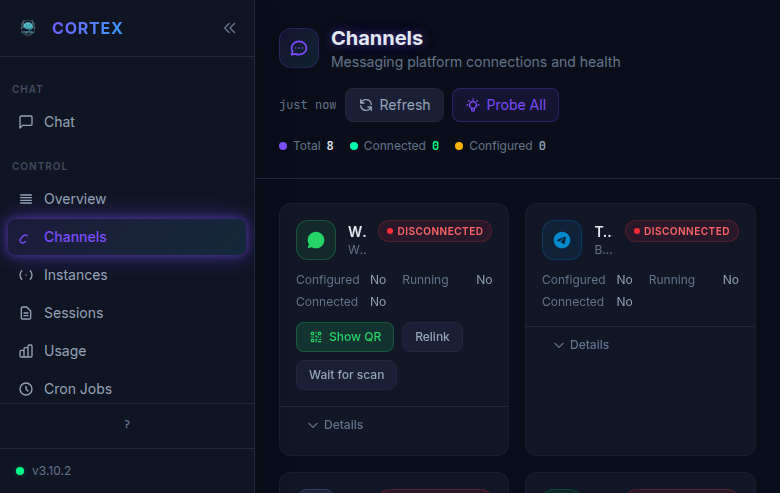
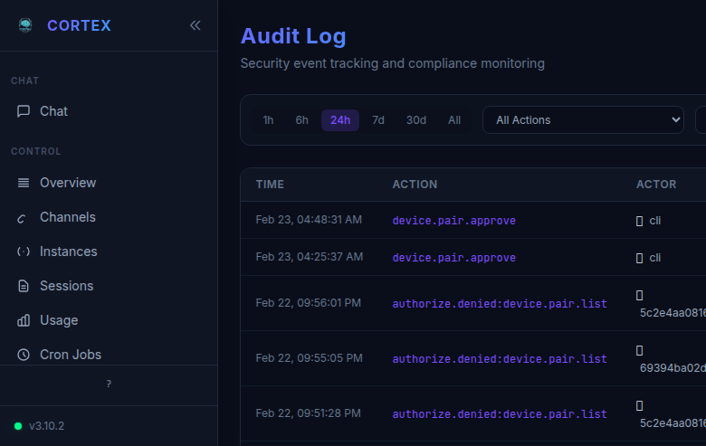
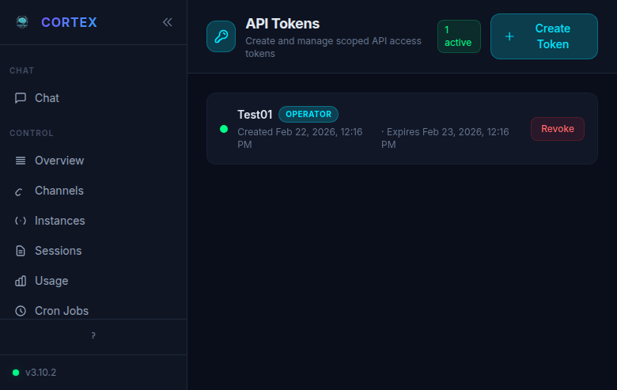
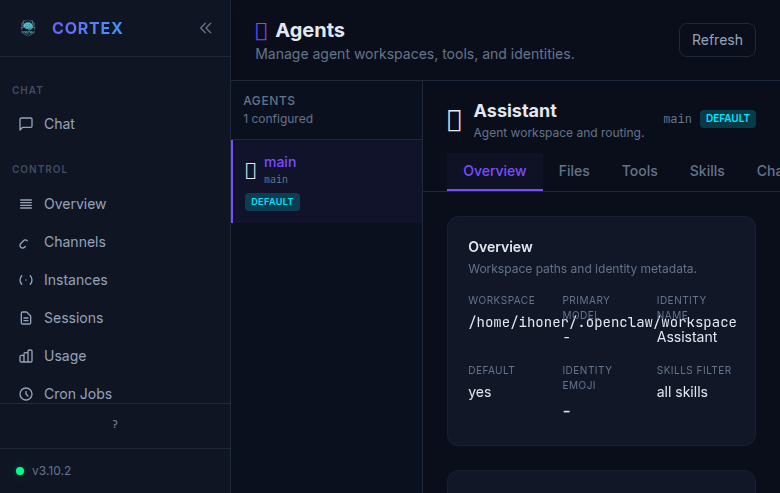
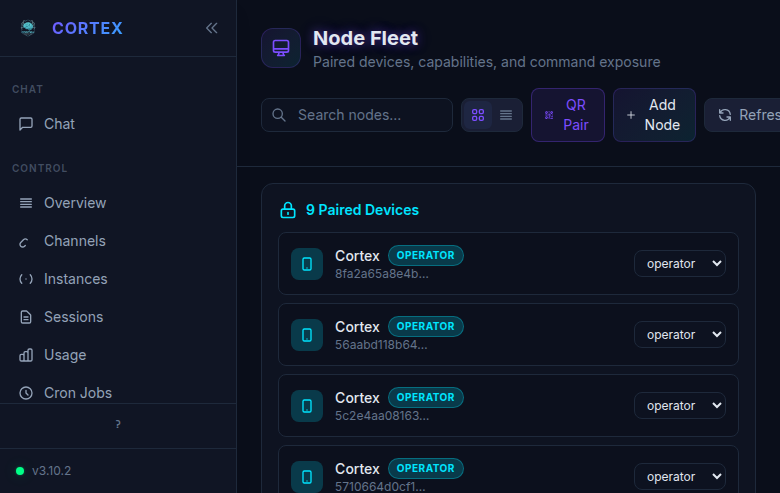
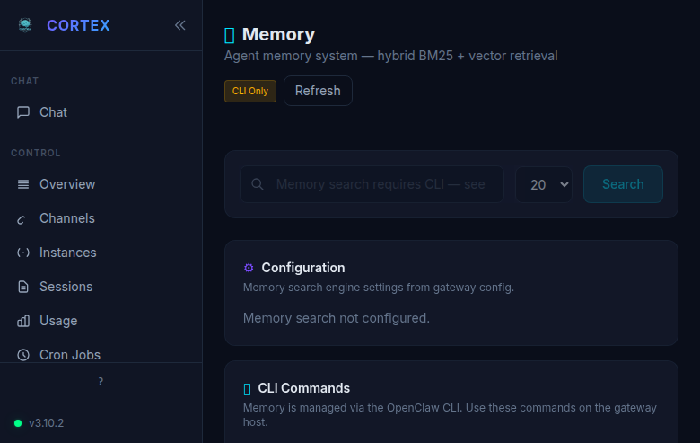
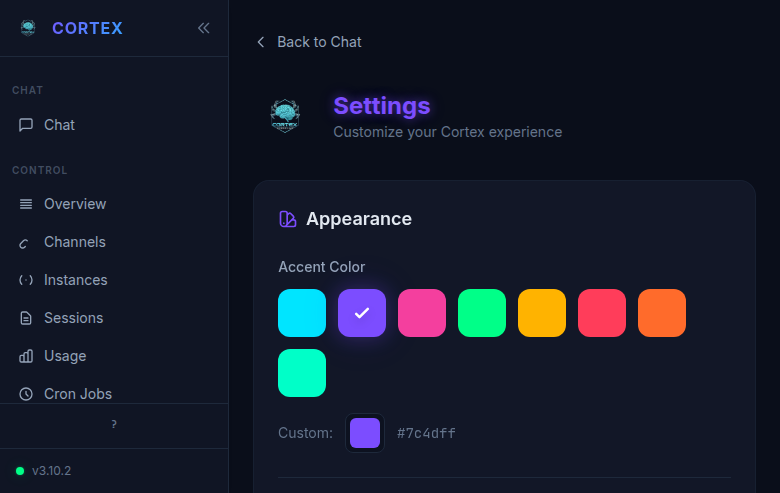
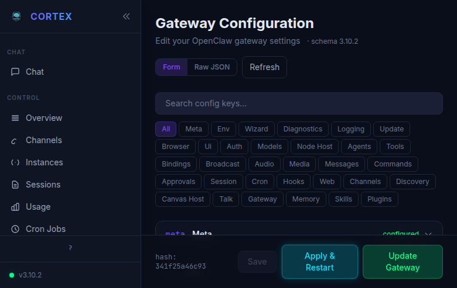
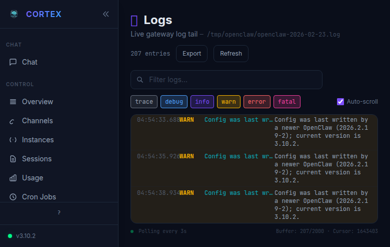

# Cortex Documentation Guide

> **The comprehensive reference for the Cortex AI Assistant Command Center.**
>
> Cortex v3.10+ · Last updated February 2026

<div style="background: var(--card); padding: 16px 20px; border-radius: 8px; margin: 24px 0; border-left: 4px solid var(--cyan);">
  <div style="display: flex; gap: 20px; align-items: center; flex-wrap: wrap;">
    <div style="font-weight: 600; color: var(--cyan); margin-right: 8px;">📖 Related Docs:</div>
    <a href="plan.html" style="display: inline-flex; align-items: center; gap: 6px; padding: 6px 12px; background: var(--bg); border-radius: 6px; text-decoration: none; color: var(--text); font-size: 14px; transition: 0.15s;">
      <span>🧠</span> Project Plan
    </a>
    <a href="config-reference.html" style="display: inline-flex; align-items: center; gap: 6px; padding: 6px 12px; background: var(--bg); border-radius: 6px; text-decoration: none; color: var(--text); font-size: 14px; transition: 0.15s;">
      <span>⚙️</span> Config Reference
    </a>
  </div>
</div>

---

## Table of Contents

1. [Introduction](#1-introduction)
2. [Getting Started](#2-getting-started)
3. [Chat](#3-chat)
4. [Overview](#4-overview)
5. [Channels](#5-channels)
6. [Instances](#6-instances)
7. [Sessions](#7-sessions)
8. [Usage Analytics](#8-usage-analytics)
9. [Cron Jobs](#9-cron-jobs)
10. [Exec Approvals](#10-exec-approvals)
11. [Audit Log](#11-audit-log)
12. [API Tokens](#12-api-tokens)
13. [Agents](#13-agents)
14. [Skills](#14-skills)
15. [Nodes](#15-nodes)
16. [Memory](#16-memory)
17. [Settings](#17-settings)
18. [Gateway Configuration](#18-gateway-configuration)
19. [Debug Console](#19-debug-console)
20. [Logs](#20-logs)
21. [Keyboard Shortcuts](#21-keyboard-shortcuts)
22. [Security & Roles](#22-security--roles)
23. [Configuration Reference](#23-configuration-reference)
24. [CLI Reference](#24-cli-reference)
25. [Troubleshooting](#25-troubleshooting)

---

## 1. Introduction

### What is Cortex?

**Cortex** is a security-hardened fork of [OpenClaw](https://github.com/openclaw/openclaw) — a personal AI assistant command center that runs on your own infrastructure. It provides a unified web UI (the **Cortex UI**) to manage an AI agent gateway that connects to LLM providers (Anthropic Claude, OpenAI GPT, etc.) and messaging channels (Discord, Signal, Telegram, WhatsApp, Slack, IRC, and more).

Think of it as your AI's brain and control panel. The gateway does the thinking — routing messages, managing sessions, calling models, executing tools — while the Cortex UI gives you full visibility and control over everything.

### What Problems Does It Solve?

- **Centralized AI Management**: One interface to control AI interactions across all your messaging platforms
- **Security-First Design**: Role-based access control, device pairing with Ed25519 identities, audit logging, and scoped API tokens
- **Self-Hosted Privacy**: Your data stays on your infrastructure — no third-party platforms see your conversations
- **Multi-Channel Presence**: Your AI assistant can respond on WhatsApp, Discord, Telegram, Slack, Signal, and more — simultaneously
- **Distributed Execution**: Offload tool execution (browser automation, file system access, system commands) to remote nodes
- **Full Observability**: Live logs, usage analytics, session management, and debug tooling

### Architecture Overview

Cortex follows a **Gateway + Nodes** architecture:

```
┌─────────────────┐    ┌──────────────────────────┐    ┌─────────────────┐
│   Web Browser   │◄──►│        Gateway            │◄──►│   Node Worker   │
│   (Cortex UI)   │    │  ┌──────────────────────┐ │    │   (headless)    │
│                 │    │  │  Control Plane        │ │    │                 │
└─────────────────┘    │  │  • Cortex Web UI      │ │    │  • Exec         │
                       │  │  • Agent Engine       │ │    │  • Browser      │
┌─────────────────┐    │  │  • Session Manager    │ │    │  • Camera       │
│  Discord Bot    │◄──►│  │  • Model Router       │ │    │  • Screen       │
│  Telegram Bot   │    │  │  • Channel Adapters   │ │    │  • Canvas       │
│  WhatsApp       │    │  │  • Memory System      │ │    └─────────────────┘
│  Signal         │    │  │  • Cron Scheduler     │ │           ▲
│  Slack          │    │  │  • Security Layer     │ │           │
│  IRC            │    │  └──────────────────────┘ │      WebSocket
└─────────────────┘    └──────────────────────────┘     Connection
                              ▲
                              │
                        Port 18789
                   (WebSocket + HTTP)
```

**Gateway (Control Plane):**

- Central coordination and routing hub
- Serves the Cortex Web UI
- Manages all LLM provider connections
- Hosts channel adapters (Discord, Telegram, etc.)
- Enforces security policies and RBAC
- Runs the agent engine, memory system, and cron scheduler

**Nodes (Execution Plane):**

- Lightweight headless workers that connect to a gateway
- Execute commands on behalf of the gateway (system, browser, camera, etc.)
- No web UI, no admin interface — pure execution
- Auto-reconnect with exponential backoff

**Web Clients:**

- The Cortex UI running in any modern browser
- Authenticates via device pairing or API tokens
- Real-time WebSocket connection to the gateway

### Quick Start

```bash
# Prerequisites: Node.js ≥ 22

# Install Cortex globally
npm install -g openclaw-cortex

# Run the onboarding wizard
cortex onboard

# Start the gateway
cortex gateway start

# Open the Cortex UI
# Default: http://localhost:18789
```

> **Migrating from OpenClaw?** Cortex is a drop-in replacement. Same data directory (`~/.openclaw/`), same config format, same protocols. See the [Migration Guide](../MIGRATION.md) for details.

---

## 2. Getting Started

### Installation Methods

#### npm Package (Recommended)

```bash
npm install -g openclaw-cortex
cortex onboard
```

The `onboard` wizard walks you through gateway setup, model provider authentication, channel integrations, and security configuration.

#### Docker

```bash
git clone https://github.com/ivanuser/cortex.git
cd cortex
docker-compose up -d
```

The Docker image exposes port 18789 by default. Map volumes for persistent data:

```yaml
volumes:
  - ~/.openclaw:/root/.openclaw
```

#### From Source

```bash
git clone https://github.com/ivanuser/cortex.git
cd cortex
npm install
npm run build
npm link
cortex onboard
```

### First-Run Setup

When you first launch Cortex, the onboarding wizard guides you through:

1. **Gateway Mode**: Local (runs on this machine) or Remote (connects to an existing gateway)
2. **Model Provider**: Configure API keys for Anthropic, OpenAI, or other providers
3. **Security**: Set up authentication — gateway token, device pairing, or both
4. **Channels**: Optionally connect messaging platforms
5. **Cortex UI**: The web interface is automatically enabled on the gateway

After onboarding, start the gateway:

```bash
# Foreground (development)
cortex gateway run

# Background service
cortex gateway start

# Check status
cortex gateway status
```

### Connecting to the Gateway

Open your browser and navigate to the gateway URL (default: `http://localhost:18789`). If the gateway is running on a different machine or behind a reverse proxy, use the appropriate URL.

> **Tip:** For remote access through Cloudflare Tunnel, nginx, or similar, make sure to add the external URL to `gateway.controlUi.allowedOrigins` in the config.

### Authentication Methods

Cortex supports multiple authentication methods, from zero-config to enterprise-grade:

#### Device Identity (Ed25519 Pairing)

The primary authentication method. When a new browser connects:

1. The browser generates a unique Ed25519 keypair (the "device identity")
2. The gateway receives a pairing request
3. An admin approves the device (via CLI or UI)
4. The device is permanently paired with a role assignment

```bash
# List pending pairing requests
cortex devices list --pending

# Approve a device
cortex devices approve <request-id>

# Approve with a specific role
cortex devices approve <request-id> --role operator
```

#### API Tokens

For programmatic access or quick authentication without device pairing:

```bash
# Create a token
cortex tokens create --name "my-token" --role operator --expires 30d

# The token (ctx_...) can be used as a URL parameter or header
# Example: ws://localhost:18789?token=ctx_abc123...
```

Tokens are prefixed with `ctx_` and can have any of the four roles: `admin`, `operator`, `viewer`, `chat-only`.

#### Pairing Codes

Six-digit numeric codes for quick device pairing:

```bash
# Generate a pairing code (valid for 5 minutes by default)
cortex pair-code --role operator
# Output: 847291
```

Enter the code in the Cortex UI when prompted to pair.

#### Invite Links

Shareable URLs that allow new devices to self-pair:

```bash
# Create an invite link
cortex invite create --role operator --uses 5 --expires 7d

# List active invites
cortex invite list

# Revoke an invite
cortex invite revoke <invite-id>
```

#### QR Codes

The Nodes page can generate QR codes containing embedded invite links for easy mobile/node pairing.

#### LAN Auto-Approve

For trusted local networks, enable automatic device approval:

```json
{
  "gateway": {
    "security": {
      "lanAutoApprove": true,
      "lanAutoApproveRole": "operator"
    }
  }
}
```

> **⚠️ Warning:** Only use LAN auto-approve on fully trusted networks. Any device on the LAN can join automatically.

---

## 3. Chat

The **Chat** page is the primary interface for interacting with your AI assistant. It uses a responsive three-panel layout optimized for session management and conversation.


### Layout

The chat interface consists of three panels:

| Panel            | Purpose      | Key Features                          |
| ---------------- | ------------ | ------------------------------------- |
| **Left Sidebar** | Navigation   | App sections, version indicator, help |
| **Middle Panel** | Session List | Search, filters, session cards        |
| **Right Panel**  | Conversation | Messages, thinking blocks, input area |

Both the left sidebar and middle panel can be collapsed using the `«` chevron buttons, giving you a full-width chat experience when needed.

### Left Sidebar

The navigation sidebar provides quick access to all Cortex sections:

- **CHAT** section — the main conversation interface
- **CONTROL** section — Overview, Channels, Instances, Sessions, Usage, Cron Jobs
- **Footer** — Help (`?`) button and version indicator with connection status (green dot = connected)

The active page is highlighted with a **teal accent bar** on the left edge and a subtle background tint.

### Session List (Middle Panel)

The middle panel is your session manager:

- **Connection Status Banner**: Shows the connection state, gateway version, protocol version, and uptime. A green dot indicates a healthy connection. Click `×` to dismiss.
- **Search Bar**: Instantly filter sessions by name or content
- **Filter Tabs**: Quick-filter by session type:
  - **All** — show every session
  - **Main** — primary agent sessions
  - **Isolated** — standalone sessions with their own context
  - **Sub** — sub-agent sessions spawned by the main agent
- **Session Count**: Shows the total number of sessions
- **New Session** (`+`): Create a new session
- **Refresh**: Sync the session list with the gateway

Each **session card** displays:

- Session name (with type indicator emoji)
- Last message preview
- Model badge (e.g., `claude-sonnet-4-6`)
- Click to open the conversation in the right panel

### Session Types

| Type          | Description                              | Use Case                                  |
| ------------- | ---------------------------------------- | ----------------------------------------- |
| **Main**      | The primary agent session                | Default conversations, persistent context |
| **Isolated**  | Independent session with its own context | Separate tasks, experiments               |
| **Sub-agent** | Spawned by the main agent for subtasks   | Background work, parallel processing      |

### Conversation Panel (Right Panel)

The right panel displays the active conversation:

- **Header**: Session name, message count badge, and current model
- **Message Display**: Messages from both you and the assistant with:
  - **Timestamps** with relative/absolute time
  - **Avatars** — colored circles for user and assistant
  - **Copy button** on hover for any message
  - **Thinking blocks** — collapsible sections showing the assistant's reasoning process (with character count)
  - **Tool calls** — expandable sections showing tool invocations and results
- **Date Dividers**: "Today", "Yesterday", etc. between messages from different days

### Input Area

The input area at the bottom of the conversation panel provides:

- **Text Input**: Type your message. Press `Enter` to send, `Shift+Enter` for a newline.
- **Image Attach Button** (📎): Click to open the file picker for images
- **Image Support**: Three ways to add images:
  - **Paste** from clipboard (`Ctrl+V` / `Cmd+V`)
  - **Drag and drop** files onto the chat
  - **File picker** via the attach button
- **Focus Shortcut**: Press `Ctrl+/` from anywhere to focus the input

> **Tip:** The input field supports multiline text. Use `Shift+Enter` to add newlines without sending the message.

---

## 4. Overview

The **Overview** page is your gateway dashboard — a quick health check showing the most important metrics at a glance.


### Dashboard Cards

The dashboard displays a grid of status cards:

| Card          | Description                 | Values                                   |
| ------------- | --------------------------- | ---------------------------------------- |
| **STATUS**    | Gateway connection state    | Connected (green), Disconnected (red)    |
| **UPTIME**    | Time since gateway started  | Duration or "n/a" if unavailable         |
| **SESSIONS**  | Active session count        | Number + main session name               |
| **MODELS**    | Available model count       | Total from all configured providers      |
| **INSTANCES** | Connected clients and nodes | Count with "View all →" link             |
| **CRON**      | Cron scheduler status       | Next run time, Enabled/Disabled badge    |
| **AUTH**      | Authentication status       | Gateway device ID (truncated), auth mode |

### Status Indicators

- **Green** border/text: Healthy, connected, active
- **Yellow/Amber**: Unknown, degraded, or unavailable
- **Purple**: Informational metrics (model count)

### Quick Links

Each card links to its corresponding detail page:

- **Instances** → "View all →" navigates to the Instances page
- **Cron** → "Manage jobs →" navigates to Cron Jobs
- **Auth** → "Configure →" navigates to Gateway Configuration

### Refresh

Click the **Refresh** button in the top-right corner to re-fetch all dashboard data from the gateway.

---

## 5. Channels

The **Channels** page manages your messaging platform integrations. Each supported platform appears as a card with status indicators and actions.



### Supported Channels

| Channel            | Description             | Auth Method        |
| ------------------ | ----------------------- | ------------------ |
| **Discord**        | Discord bot integration | Bot token          |
| **Signal**         | Signal messenger        | Linked device (QR) |
| **Telegram**       | Telegram bot            | Bot token          |
| **WhatsApp**       | WhatsApp Web            | QR code linking    |
| **Slack**          | Slack workspace         | OAuth / Bot token  |
| **IRC**            | IRC networks            | Server/nick config |
| **Google Chat**    | Google Workspace        | Service account    |
| **Nextcloud Talk** | Nextcloud chat          | App password       |
| **iMessage**       | Apple Messages          | macOS bridge       |

### Channel Cards

Each channel card displays:

- **Avatar**: Platform icon/initial with a colored circle
- **Name**: Channel identifier
- **Status Badge**:
  - 🟢 **CONNECTED** — fully operational
  - 🔴 **DISCONNECTED** — not running or connection lost
  - 🟡 **CONFIGURED** — settings present but not connected
- **Status Properties**:
  - **Configured**: Whether the channel has configuration values set
  - **Running**: Whether the channel adapter process is active
  - **Connected**: Whether the channel has an active connection to the platform
- **Details**: Expandable section (`▽ Details`) with additional channel information

### Actions

Depending on the channel type, different action buttons appear:

| Action            | Description                        | Channels         |
| ----------------- | ---------------------------------- | ---------------- |
| **Show QR**       | Display QR code for device linking | WhatsApp, Signal |
| **Relink**        | Reset and re-establish connection  | WhatsApp, Signal |
| **Wait for scan** | Begin QR scan listener             | WhatsApp, Signal |
| **Probe All**     | Test connectivity for all channels | All              |

The **Probe All** button in the toolbar sends a health check to every configured channel and refreshes their status.

### Summary Stats

At the top of the page, inline statistics show:

- **Total**: Number of configured channels
- **Connected**: Actively connected channels
- **Configured**: Channels with saved settings

### Configuring a Channel

Channel configuration is done through the [Gateway Configuration](#18-gateway-configuration) page under the **Channels** section. Each channel has its own set of required fields (tokens, API keys, phone numbers, etc.).

Example channel config (Telegram):

```json
{
  "channels": {
    "telegram": {
      "token": "123456:ABC-DEF...",
      "allowedUsers": ["your_username"]
    }
  }
}
```

> **Tip:** After configuring a channel in the config editor, click **Apply & Restart** to activate it. Then return to the Channels page to verify the connection status.

---

## 6. Instances

The **Instances** page shows all real-time connected clients and nodes — a live view of who and what is connected to your gateway.


### Instance Cards

Each connected instance is displayed as a card with:

- **Online Indicator**: Green dot for active connections
- **Hostname**: The display name of the connected device
- **Connection Type**: How the instance connected (e.g., "self" for the gateway, "connect" for clients)
- **System Info**: Operating system, kernel version, and architecture
- **Tags**: Role and capability badges:

| Tag          | Description                 |
| ------------ | --------------------------- |
| **gateway**  | The gateway process itself  |
| **webchat**  | A Cortex UI browser session |
| **node**     | A connected node worker     |
| **operator** | Device with operator role   |
| **admin**    | Device with admin role      |
| **viewer**   | Device with viewer role     |
| **v3.10.2**  | Version badge               |

- **Scopes**: Number of authorized scopes (e.g., "3 scopes")
- **Details**: Expandable section with full connection metadata

### Refresh

Click **Refresh** to update the instance list. Instances appear and disappear in real-time as devices connect and disconnect.

> **Note:** The gateway itself always appears as an instance (tagged "self"). This is normal and shows the gateway's own system information.

---

## 7. Sessions

The **Sessions** page is a comprehensive session management dashboard, giving you full control over all active and historical sessions.


### Stats Bar

Five summary cards across the top:

| Stat           | Description                       | Color  |
| -------------- | --------------------------------- | ------ |
| **Total**      | All sessions                      | White  |
| **Main**       | Primary agent sessions            | Green  |
| **Isolated**   | Standalone sessions               | Cyan   |
| **Sub-agents** | Child sessions                    | Yellow |
| **Tokens**     | Total token usage across sessions | Green  |

### Search and Filters

- **Search**: Filter sessions by name or content
- **Sort**: Choose sort order — "Activity" (most recent first), "Name", "Tokens", "Created"
- **View Modes**:
  - **List**: Flat list of all sessions
  - **Tree**: Hierarchical view showing parent-child relationships (main → sub-agents)
- **Grouping**:
  - **Grouped**: Sessions organized by type (main, isolated, sub-agents)
  - **All**: Flat ungrouped list
- **Filters Button**: Additional filter options

### Session Cards

Each session card provides:

- **Session Name**: With an edit (pencil) icon to rename inline
- **Type Badge**: "main", "isolated", or "sub" tag
- **Toggle Indicators**: "T:off" (thinking visibility), "V:off" (verbose mode)
- **Model Badge**: Current model (e.g., `claude-sonnet-4-6`) with brain icon
- **Token Count**: Total tokens used in this session
- **Session Key**: The internal identifier (e.g., `agent:main:main`)
- **Timestamp**: Last activity time

### Inline Controls

Each session card has action controls:

| Control            | Description                                                                          |
| ------------------ | ------------------------------------------------------------------------------------ |
| **Model Dropdown** | Override the model for this session (e.g., switch from Claude Sonnet to Claude Opus) |
| **Chat**           | Jump to this session in the Chat view                                                |
| **Delete** (🗑)    | Delete the session and its history                                                   |
| **Rename** (✏️)    | Edit the session name inline                                                         |

> **Tip:** Model override is per-session. If you set a model on a session, it takes priority over the agent's default model. Clear the override to return to the default.

---

## 8. Usage Analytics

The **Usage Analytics** page tracks token consumption, costs, and session activity across your gateway. Essential for monitoring spend and understanding usage patterns.


### View Toggle

Switch between two views:

- **Tokens**: Focus on token consumption (input/output breakdown)
- **Cost**: Focus on dollar costs per session and over time

### Date Range Selector

Filter analytics by time period:

| Preset    | Range            |
| --------- | ---------------- |
| **Today** | Current day only |
| **7d**    | Last 7 days      |
| **30d**   | Last 30 days     |
| **90d**   | Last 90 days     |

You can also set custom date ranges using the calendar date pickers.

The range indicator shows how many sessions fall within the selected period.

### Metrics Cards

| Metric             | Description                          | Example                                  |
| ------------------ | ------------------------------------ | ---------------------------------------- |
| **TOTAL TOKENS**   | Sum of all input + output tokens     | "14.1K" with "10 in · 146 out" breakdown |
| **TOTAL COST**     | Estimated cost in USD                | "$0.05" with per-session average         |
| **SESSIONS**       | Number of sessions in the time range | Session count                            |
| **CACHE HIT RATE** | Percentage of prompt cache hits      | Visual bar + percentage                  |

### Cost Tracking

Cost is estimated based on the token pricing for each model used. The analytics page aggregates across all sessions and model providers. The cost breakdown includes:

- Per-session average cost
- Input vs. output token split
- Cache efficiency metrics

> **Note:** Cost estimates are based on published provider pricing. Actual billing may differ slightly due to rounding, caching credits, or promotional pricing.

---

## 9. Cron Jobs

The **Cron Jobs** page lets you schedule recurring tasks for your AI agent — automated wakeups, periodic checks, report generation, or any repeating workflow.


### Overview

Cron jobs are scheduled tasks that run on the gateway. Each job can:

- Send a message to the agent on a schedule
- Trigger a system event at specified intervals
- Run in the main session or in an isolated session
- Use a specific model override

### Status Indicator

The header shows the global cron status:

- 🟢 **Active**: The cron scheduler is running
- 🔴 **Paused**: Cron is disabled in configuration

### Creating a Job

Click **+ Create Job** to open the job creation form:

| Field              | Description                 | Options                                                   |
| ------------------ | --------------------------- | --------------------------------------------------------- |
| **Name**           | Human-readable job name     | Free text                                                 |
| **Schedule Type**  | How to specify timing       | `at` (one-time), `every` (interval), `cron` (expression)  |
| **Schedule**       | The timing specification    | "every 30m", "0 9 \* \* 1-5", "at 2024-03-01T09:00"       |
| **Payload Type**   | What the job does           | `agentTurn` (send message), `systemEvent` (trigger event) |
| **Payload**        | The message or event data   | Free text or JSON                                         |
| **Session Target** | Where to run                | `main` (main session), `isolated` (new isolated session)  |
| **Model Override** | Optional model for this job | Any available model                                       |
| **Delivery**       | Channel routing             | Target channel or "last"                                  |

### Schedule Types

```bash
# Run every 30 minutes
every 30m

# Run at a specific cron schedule (Mon-Fri at 9 AM)
0 9 * * 1-5

# Run once at a specific time
at 2026-03-01T09:00:00Z
```

### Job Cards

Each configured job appears as a card with:

- **Job Name**: The human-readable name
- **Schedule**: The timing specification
- **Status**: Enabled (green toggle) or Disabled
- **Next Run**: When the job will fire next
- **Actions**:
  - **Enable/Disable Toggle**: Pause or resume the job
  - **Run Now**: Trigger the job immediately
  - **Edit**: Modify the job configuration
  - **Delete**: Remove the job

### Configuration

Cron can also be configured via the gateway config:

```json
{
  "cron": {
    "enabled": true,
    "store": "~/.openclaw/cron.db",
    "maxConcurrentRuns": 3,
    "sessionRetention": "7d"
  }
}
```

> **Tip:** Use `agentTurn` payload type to send a message as if you typed it. Use `systemEvent` for internal triggers that the agent handles via system prompt instructions.

---

## 10. Exec Approvals

The **Exec Approvals** page manages the command approval system — a security feature that requires human approval before the AI agent can execute certain shell commands.


### Two-Tab Interface

The page has two tabs:

#### Queue Tab

The **Queue** shows real-time pending command approval requests:

- **Pending Approvals**: Commands waiting for human review
  - Each request shows the command the agent wants to run
  - **Countdown Timer**: Time remaining before the request auto-expires
  - **Approve** (green): Allow the command to execute
  - **Deny** (red): Block the command
- **Recent Decisions**: History of recently approved/denied commands for this session

When the queue is empty, a green checkmark icon confirms "No pending approval requests" with the message "Requests will appear here in real-time when agents need permission."

#### Allowlist Tab

The **Allowlist** is a structured JSON editor for configuring permanent command allowlists:

- Commands on the allowlist run without approval
- Allowlists are scoped per security level
- Use patterns and wildcards for flexible matching

Example allowlist configuration:

```json
{
  "full": ["*"],
  "allowlist": ["ls *", "cat *", "grep *", "git status", "git log *", "npm test", "node *"],
  "deny": ["rm -rf *", "sudo *"]
}
```

### Security Modes

The exec approval system supports three security modes:

| Mode          | Description                                                |
| ------------- | ---------------------------------------------------------- |
| **full**      | All commands allowed without approval                      |
| **allowlist** | Only allowlisted commands run freely; others need approval |
| **deny**      | All commands require approval                              |

> **⚠️ Security Note:** The `full` mode should only be used in trusted development environments. For production, use `allowlist` with carefully curated commands.

---

## 11. Audit Log

The **Audit Log** page provides a security event timeline — every significant action in your Cortex gateway is recorded and displayed here.



### Time Range Filters

Quick-select buttons filter the log by time window:

| Filter  | Range                   |
| ------- | ----------------------- |
| **1h**  | Last hour               |
| **6h**  | Last 6 hours            |
| **24h** | Last 24 hours (default) |
| **7d**  | Last 7 days             |
| **30d** | Last 30 days            |
| **All** | All recorded events     |

### Action Type Filter

The **All Actions** dropdown lets you filter by specific event types:

- `device.pair.approve` — A device pairing was approved
- `device.pair.reject` — A device pairing was rejected
- `authorize.denied` — An action was blocked due to insufficient permissions
- `token.create` — An API token was created
- `token.revoke` — An API token was revoked
- `config.apply` — Gateway configuration was applied
- `config.set` — A configuration value was changed
- `device.role.set` — A device's role was changed

### Log Table

The audit log displays events in a table with three columns:

| Column     | Description                                                           |
| ---------- | --------------------------------------------------------------------- |
| **TIME**   | Timestamp of the event (e.g., "Feb 23, 04:48:31 AM")                  |
| **ACTION** | The event type in purple monospace text (e.g., `device.pair.approve`) |
| **ACTOR**  | Who performed the action — either "cli" or a truncated device ID      |

Each actor field has a clipboard icon for copying the full device ID.

### Logged Events

The audit system tracks:

- **Authentication**: Device pairing (approve/reject), token creation/revocation
- **Authorization**: Permission denials with the specific method that was blocked
- **Configuration**: Config changes, applies, and restarts
- **Session**: Session creation, deletion, compaction
- **Admin**: Role changes, device removals, security setting changes

> **Tip:** Use the audit log to track down "authorize.denied" events when debugging permission issues. The action field shows exactly which method was blocked (e.g., `authorize.denied:device.pair.list`).

---

## 12. API Tokens

The **API Tokens** page lets you create and manage scoped access tokens for programmatic or quick-access authentication.



### What Are API Tokens?

API tokens provide instant authentication without the device pairing flow. They're useful for:

- CI/CD pipelines that need gateway access
- Scripts and automation tools
- Quick browser access (paste token in URL)
- Temporary access for collaborators

All tokens are prefixed with `ctx_` for easy identification.

### Creating a Token

Click **+ Create Token** to open the creation form:

| Field          | Description            | Options                                        |
| -------------- | ---------------------- | ---------------------------------------------- |
| **Name**       | Human-readable label   | Free text (e.g., "CI Pipeline", "Test Token")  |
| **Role**       | Permission level       | `admin`, `operator`, `viewer`, `chat-only`     |
| **Expiration** | When the token expires | Duration (e.g., "24h", "7d", "30d") or "never" |

> **⚠️ Important:** The full token is only shown once at creation time. Copy it immediately — it cannot be retrieved later.

### Token List

Each token appears as a card showing:

- **Name**: The token's label (e.g., "Test01")
- **Role Badge**: Color-coded role indicator (e.g., purple "OPERATOR" pill)
- **Status**: Green dot for active tokens
- **Created Date**: When the token was issued
- **Expiry Date**: When the token will expire
- **Revoke Button**: Red button to immediately invalidate the token

The header shows a count badge (e.g., "1 active") for quick reference.

### Using Tokens

Tokens can be used in several ways:

```bash
# As a URL parameter
ws://localhost:18789?token=ctx_abc123...

# As a CLI option
cortex devices list --token ctx_abc123...

# In the Cortex UI connection settings
# Paste the token in the gateway token field
```

### Token Security

- Tokens inherit the permissions of their assigned role
- Revoking a token immediately terminates all sessions using it
- Tokens are stored as hashed values — the gateway never stores the plaintext
- Expired tokens are automatically invalidated

---

## 13. Agents

The **Agents** page manages agent workspaces, identities, tools, and channel bindings. Each agent is an independent AI personality with its own configuration.



### Agent Selector (Left Sub-Panel)

The left panel shows all configured agents:

- **Agent Count**: "1 configured" (or more)
- **Agent Entry**: Each agent shows its name, ID, and role badges:
  - **DEFAULT** badge: The agent that handles unrouted messages
  - Click to select and view its details

### Agent Detail Panel (Right Sub-Panel)

The detail panel has **six tabs**:

#### Overview Tab

Displays workspace paths and identity metadata:

| Field              | Description                                                               |
| ------------------ | ------------------------------------------------------------------------- |
| **WORKSPACE**      | File system path to the agent's workspace (e.g., `~/.openclaw/workspace`) |
| **PRIMARY MODEL**  | The default LLM model for this agent                                      |
| **IDENTITY NAME**  | Display name (e.g., "Assistant")                                          |
| **DEFAULT**        | Whether this is the default agent                                         |
| **IDENTITY EMOJI** | Optional emoji identifier                                                 |
| **SKILLS FILTER**  | Which skills this agent can use ("all skills" or specific list)           |

#### Files Tab

A workspace file browser showing the agent's files:

- `AGENTS.md` — Agent behavior instructions
- `SOUL.md` — Personality definition
- `USER.md` — User context
- `MEMORY.md` — Long-term memory
- `memory/` — Daily memory files
- Other workspace files

#### Tools Tab

Lists all tools available to this agent:

- Tool name and description
- Source (built-in, skill, plugin)
- Enabled/disabled status

#### Skills Tab

Shows skills installed for this specific agent:

- Skill name and source
- Configuration status
- Enable/disable controls

#### Channels Tab

Channel bindings — which messaging channels this agent responds on:

- Channel assignment list
- Priority and routing rules
- Binding configuration

#### Cron Jobs Tab

Agent-specific scheduled tasks:

- Cron jobs that target this agent
- Schedule and status information
- Quick management controls

### Multi-Agent Setup

Cortex supports multiple agents, each with their own:

- Workspace files and memory
- Model preferences
- Channel bindings
- Skills and tools
- Personality and behavior

Configure multiple agents in the gateway config:

```json
{
  "agents": {
    "list": [
      {
        "id": "main",
        "identity": { "name": "Assistant" },
        "default": true
      },
      {
        "id": "coder",
        "identity": { "name": "CodeBot", "emoji": "🤖" },
        "model": "claude-sonnet-4-6"
      }
    ]
  }
}
```

---

## 14. Skills

The **Skills** page is a library browser for agent skills — modular capability packages that extend what your agent can do.


### What Are Skills?

Skills are markdown-based instruction packages that teach the agent how to use specific tools or perform certain tasks. They're like "training manuals" that get injected into the agent's system prompt when relevant.

### Stats Bar

Four summary cards:

| Stat          | Description                             |
| ------------- | --------------------------------------- |
| **Total**     | All available skills                    |
| **Bundled**   | Skills included with Cortex             |
| **Workspace** | Skills from agent workspace directories |
| **Managed**   | Skills installed via the skill manager  |

### Search and Filter

- **Search Input**: Filter skills by name or description
- **Source Filter**: Dropdown to filter by source — "All Sources", "Bundled", "Workspace", "Managed"

### Skill Cards

Each skill appears as a card with:

- **Name**: Skill identifier (e.g., "1password", "apple-notes", "docker")
- **Source Badge**: Green "bundled" pill, cyan "workspace" pill, or yellow "managed" pill
- **Description**: What the skill teaches the agent to do
- **File Path**: Full path to the skill file on disk

### Installing Skills

Click **+ Install** to add new skills:

- Install from npm packages
- Install from local directories
- Install from Git repositories

Skills are loaded from these locations:

1. **Bundled**: Included in the Cortex package (`node_modules/openclaw-cortex/skills/`)
2. **Workspace**: Agent workspace `skills/` directory
3. **Extra Dirs**: Additional directories specified in config

### Skill Configuration

```json
{
  "skills": {
    "allowBundled": ["docker", "git", "ssh"],
    "load": {
      "extraDirs": ["/opt/custom-skills"],
      "watch": true,
      "watchDebounceMs": 1000
    },
    "limits": {
      "maxSkillsInPrompt": 10,
      "maxSkillsPromptChars": 50000
    }
  }
}
```

> **Tip:** If you have too many bundled skills, use `allowBundled` to whitelist only the ones you need. This keeps the agent's system prompt focused and reduces token usage.

---

## 15. Nodes

The **Nodes** page manages your node fleet — remote worker machines that execute commands on behalf of the gateway.



### What Are Nodes?

Nodes are headless worker processes that connect to your gateway via WebSocket. They provide execution capabilities that the gateway can delegate to:

- **System**: Shell command execution, file system access
- **Browser**: Browser automation (Playwright/CDP)
- **Camera**: Camera snapshots (on supported hardware)
- **Screen**: Screen recording/capture
- **Canvas**: Interactive visual rendering (on supported platforms)

### Toolbar

The node fleet toolbar provides:

| Button               | Description                                  |
| -------------------- | -------------------------------------------- |
| **Search**           | Filter nodes by name or ID                   |
| **Grid/List Toggle** | Switch between grid and list view            |
| **QR Pair**          | Generate a QR code for quick node pairing    |
| **+ Add Node**       | Show installation instructions for new nodes |
| **Refresh**          | Refresh the node list                        |

### Paired Devices

Each paired device appears as a card showing:

- **Device Icon**: Teal device indicator
- **Name**: Device hostname (e.g., "Cortex", "AIcreations")
- **Role Badge**: Color-coded role indicator (e.g., green "OPERATOR")
- **Device ID**: Truncated Ed25519 identity hash
- **Role Dropdown**: Change the device's role inline (admin, operator, viewer, chat-only)

### Adding a Node

Click **+ Add Node** to reveal one-liner installation commands:

```bash
# Install the node package
npm install -g openclaw-cortex

# Connect to the gateway
cortex node run --host gateway.example.com --port 18789

# Or install as a system service
cortex node install --host gateway.example.com --port 18789
cortex node start
```

### QR Pair

Click **QR Pair** to generate a QR code containing an embedded invite link. Scan with a mobile device or another machine's camera to pair automatically.

The QR code encodes:

- Gateway URL
- Invite token
- Role assignment
- Expiration

### Node Detail Panel

Click a node card to expand its detail panel with three tabs:

| Tab                | Description                                         |
| ------------------ | --------------------------------------------------- |
| **Details**        | Full system info, capabilities, connection metadata |
| **Invoke**         | Send commands directly to the node                  |
| **Exec Allowlist** | Configure which commands this node can run          |

### Node Configuration

Nodes store their configuration in `~/.openclaw/node-host.json`:

```json
{
  "nodeId": "unique-node-id",
  "displayName": "My Node",
  "gateway": {
    "host": "gateway.example.com",
    "port": 18789,
    "tls": false
  }
}
```

---

## 16. Memory

The **Memory** page provides a dashboard for the agent memory system — a hybrid BM25 + vector retrieval engine that gives your agent persistent, searchable memory.



### Overview

The memory system allows your agent to:

- Remember past conversations and context
- Search through workspace files and documentation
- Retrieve relevant information using hybrid search (keyword BM25 + semantic vector)
- Build long-term knowledge across sessions

### CLI Only

Memory operations are currently **CLI-only** — they cannot be triggered from the web UI. The Memory page provides reference information and configuration status, but actual indexing and searching is done via the command line.

> **Note:** The "CLI Only" badge indicates that memory management requires gateway shell access. Future versions may add web-based memory management.

### Search Interface

The search panel shows:

- **Search Input**: With a note that "Memory search requires CLI"
- **Results Count**: Configurable number of results (default: 20)
- **Search Button**: Triggers a search (requires CLI backend)

### Configuration Card

The configuration card displays current memory engine settings from the gateway config:

- Memory backend (builtin or qmd)
- Search mode (query, search, vsearch)
- Citation mode (auto, on, off)
- Index paths and patterns

When memory is not configured, it shows "Memory search not configured."

### CLI Commands Reference

The CLI Commands card provides quick reference for memory management:

```bash
# Check memory system status
cortex memory status

# Index workspace files for search
cortex memory index

# Search memory
cortex memory search "your query here"

# Index with specific agent
cortex memory index --agent main

# Force re-index all files
cortex memory index --force
```

### Memory Configuration

Configure memory in the gateway config:

```json
{
  "memory": {
    "backend": "builtin",
    "citations": "auto",
    "qmd": {
      "command": "qmd",
      "searchMode": "search",
      "includeDefaultMemory": true,
      "paths": [
        {
          "path": "~/.openclaw/workspace/memory",
          "name": "daily-notes",
          "pattern": "*.md"
        }
      ],
      "sessions": {
        "enabled": true,
        "exportDir": "~/.openclaw/agents/main/sessions",
        "retentionDays": 30
      },
      "update": {
        "interval": "30m",
        "onBoot": true
      },
      "limits": {
        "maxResults": 20,
        "maxSnippetChars": 500,
        "maxInjectedChars": 10000,
        "timeoutMs": 30000
      }
    }
  }
}
```

### Memory Files

The Memory page also includes a file browser for viewing and editing workspace memory files directly:

- `MEMORY.md` — Curated long-term memories
- `memory/YYYY-MM-DD.md` — Daily memory logs
- Other memory-related workspace files

---

## 17. Settings

The **Settings** page lets you customize the Cortex UI appearance and configure gateway connection details.



### Navigation

The Settings page is accessed from the `⚙` icon or by pressing `Ctrl+,`. A "← Back to Chat" link at the top returns you to the conversation view.

### Appearance

#### Accent Color

Customize the UI accent color used throughout the interface:

**Preset Colors** (8 swatches):

1. Cyan/Aqua
2. Purple/Violet (default)
3. Hot Pink/Magenta
4. Green
5. Yellow/Amber
6. Rose/Pink
7. Orange/Coral
8. Mint/Light Cyan

A **checkmark (✓)** overlay indicates the currently selected color.

**Custom Color**: Enter any hex color code (e.g., `#7c4dff`) in the text input. A small preview swatch shows the current color.

The accent color affects:

- Active navigation highlights
- Buttons and interactive elements
- Links and badges
- Input field focus states
- Status indicators

### Gateway Connection

Configure which gateway the UI connects to:

- **Gateway URL**: WebSocket URL (e.g., `ws://localhost:18789`)
- **Token**: API token for authentication (if required)

> **Tip:** Settings are stored in your browser's local storage. Clearing browser data will reset them to defaults.

---

## 18. Gateway Configuration

The **Gateway Configuration** page is a full-featured configuration editor for your Cortex gateway. It provides both a structured form view and a raw JSON editor.



### View Modes

Two editing modes are available, toggled at the top:

| Mode         | Description                                        | Best For                               |
| ------------ | -------------------------------------------------- | -------------------------------------- |
| **Form**     | Structured visual editor with categorized sections | Day-to-day config changes              |
| **Raw JSON** | Direct JSON text editor                            | Bulk edits, copy/paste, advanced users |

### Form View

The form view organizes configuration into **category buttons** — clickable pills that filter the config to a specific section:

| Category        | Settings                                             |
| --------------- | ---------------------------------------------------- |
| **Meta**        | Config metadata, version tracking                    |
| **Env**         | Environment variables, shell env                     |
| **Wizard**      | Onboarding wizard state                              |
| **Diagnostics** | OpenTelemetry, cache tracing                         |
| **Logging**     | Log levels, file paths, redaction                    |
| **Update**      | Update channel (stable/beta/dev)                     |
| **Browser**     | Browser automation settings, CDP, profiles           |
| **UI**          | UI customization (seam color, assistant name/avatar) |
| **Auth**        | Authentication profiles, provider auth, cooldowns    |
| **Models**      | Model provider configuration                         |
| **Node Host**   | Node browser proxy settings                          |
| **Agents**      | Agent definitions, identities, models                |
| **Tools**       | Tool configuration and limits                        |
| **Bindings**    | Channel-to-agent routing                             |
| **Broadcast**   | Multi-agent message broadcasting                     |
| **Audio**       | Voice/TTS settings                                   |
| **Media**       | Media handling options                               |
| **Messages**    | Message formatting and limits                        |
| **Commands**    | Command execution settings                           |
| **Approvals**   | Exec approval configuration                          |
| **Session**     | Session management settings                          |
| **Cron**        | Cron scheduler settings                              |
| **Hooks**       | Webhook configuration                                |
| **Web**         | WebSocket settings, heartbeat, reconnect             |
| **Channels**    | Messaging platform configuration                     |
| **Discovery**   | mDNS and wide-area discovery                         |
| **Canvas Host** | Canvas rendering server                              |
| **Talk**        | Voice/TTS provider settings                          |
| **Gateway**     | Core gateway settings (port, bind, TLS, security)    |
| **Memory**      | Memory system configuration                          |
| **Skills**      | Skill loading and limits                             |
| **Plugins**     | Plugin management                                    |

### Search

The **Search config keys** input filters all configuration fields across all categories. Type a keyword to find the relevant setting quickly.

### Config Status

Each section shows a status indicator:

- ✅ **configured** (green): Section has custom values set
- The config **hash** is displayed for version tracking

### Action Buttons

Three action buttons at the bottom of the page:

| Button              | Description                                   | Effect                                         |
| ------------------- | --------------------------------------------- | ---------------------------------------------- |
| **Save**            | Save changes to disk without restarting       | Config file updated, no service restart        |
| **Apply & Restart** | Save and restart the gateway to apply changes | Full restart, all connections temporarily drop |
| **Update Gateway**  | Check for and install Cortex updates          | Downloads and installs the latest version      |

### Schema Version

The header shows the current schema version (e.g., "schema 3.10.2") to help identify config compatibility.

> **⚠️ Warning:** Clicking **Apply & Restart** will briefly disconnect all clients and channels while the gateway restarts. Active conversations will resume automatically after reconnection.

---

## 19. Debug Console

The **Debug Console** provides a manual RPC interface for sending raw gateway methods — essential for testing, debugging, and advanced troubleshooting.


### Manual RPC Console

The debug console card contains:

- **Method Input**: Enter any gateway RPC method name (e.g., `status`, `health`, `sessions.list`, `config.set`)
- **Params (JSON) Textarea**: Enter method parameters as JSON (defaults to `{}`)
- **Execute Button**: Send the request (`Ctrl+Enter` keyboard shortcut)
- **Response Display**: Shows the raw JSON response from the gateway

### Common Methods

| Method             | Description                      | Example Params                                |
| ------------------ | -------------------------------- | --------------------------------------------- |
| `status`           | Gateway status summary           | `{}`                                          |
| `health`           | Health check with channel status | `{}`                                          |
| `sessions.list`    | List all sessions                | `{}`                                          |
| `models.list`      | List available models            | `{}`                                          |
| `config.set`       | Set a config value               | `{"path": "logging.level", "value": "debug"}` |
| `cron.list`        | List cron jobs                   | `{}`                                          |
| `audit.query`      | Query audit log                  | `{"limit": 10}`                               |
| `device.pair.list` | List paired devices              | `{}`                                          |
| `logs.tail`        | Tail gateway logs                | `{"limit": 50}`                               |

### Use Cases

- **Testing RPC methods** before building automation around them
- **Debugging permissions** — see exactly what error a method returns for a given role
- **Inspecting gateway state** — query internal status that may not be exposed in the UI
- **Triggering admin actions** — advanced operations not yet in the UI

> **Tip:** Use `Ctrl+Enter` to execute quickly without clicking the button. The response area scrolls automatically for large responses.

---

## 20. Logs

The **Logs** page provides a live tail of gateway log output — essential for monitoring, debugging, and understanding what your gateway is doing in real time.



### Log Header

- **Log File Path**: Shows the current log file location (e.g., `/tmp/openclaw/openclaw-2026-02-23.log`)
- **Entry Count**: Total number of log entries in the buffer (e.g., "207 entries")
- **Export Button**: Download the current log buffer as a file
- **Refresh Button**: Force a log refresh

### Filter Controls

- **Search Input**: Filter log entries by text content. Only matching entries are displayed.
- **Level Filters**: Toggle buttons for each log level:

| Level     | Color        | Description                    |
| --------- | ------------ | ------------------------------ |
| **trace** | Gray         | Extremely detailed debugging   |
| **debug** | Purple       | Detailed debugging information |
| **info**  | Blue/Cyan    | Normal operational messages    |
| **warn**  | Yellow/Amber | Warning conditions             |
| **error** | Red          | Error conditions               |
| **fatal** | Pink/Magenta | Critical failures              |

Click a level button to toggle it on/off. Multiple levels can be active simultaneously.

- **Auto-scroll**: Checkbox to automatically scroll to the newest log entry (enabled by default)

### Log Entries

Each log entry displays:

| Field           | Description                                                  |
| --------------- | ------------------------------------------------------------ |
| **Timestamp**   | High-precision time (e.g., `04:54:33.68`) in monospace font  |
| **Level Badge** | Color-coded pill showing the log level (e.g., yellow "WARN") |
| **Message**     | The log message text, with truncation for long messages      |

### Status Bar

The bottom status bar shows:

- **Polling Indicator**: Green dot with polling interval (e.g., "Polling every 3s")
- **Buffer Stats**: Current buffer size and maximum (e.g., "Buffer: 207/2000")
- **Cursor**: Current read cursor position in the log file

### Log Configuration

Configure logging in the gateway config:

```json
{
  "logging": {
    "level": "info",
    "file": "/tmp/openclaw/openclaw.log",
    "consoleLevel": "warn",
    "consoleStyle": "pretty",
    "redactSensitive": "tools",
    "redactPatterns": ["password", "token", "secret"]
  }
}
```

| Setting           | Description           | Options                                                      |
| ----------------- | --------------------- | ------------------------------------------------------------ |
| `level`           | File log level        | `silent`, `fatal`, `error`, `warn`, `info`, `debug`, `trace` |
| `consoleLevel`    | Console output level  | Same as above                                                |
| `consoleStyle`    | Console format        | `pretty`, `compact`, `json`                                  |
| `redactSensitive` | Redact sensitive data | `off`, `tools`                                               |

> **Tip:** Set `level` to `debug` or `trace` temporarily when troubleshooting. Remember to set it back to `info` afterward to avoid excessive log volume.

---

## 21. Keyboard Shortcuts

Cortex supports keyboard shortcuts for quick navigation and actions:

| Shortcut           | Action                                                   |
| ------------------ | -------------------------------------------------------- |
| `Ctrl+K` / `Cmd+K` | Quick search — search sessions, settings, and navigation |
| `Ctrl+/`           | Focus the chat input field                               |
| `Ctrl+,`           | Open Settings                                            |
| `Ctrl+Enter`       | Execute command in Debug Console                         |
| `Shift+Enter`      | New line in chat input (without sending)                 |
| `Enter`            | Send message in chat input                               |
| `Escape`           | Close modals, dismiss overlays                           |

### Help Button

Click the **`?`** button in the navigation sidebar footer to see all available keyboard shortcuts in a popup overlay.

> **Note:** On macOS, `Ctrl` is replaced by `Cmd` for most shortcuts.

---

## 22. Security & Roles

Cortex implements a comprehensive security model with role-based access control (RBAC), device identity verification, and audit logging.

### Role Hierarchy

Cortex uses a **4-tier role hierarchy** where higher roles inherit all permissions of lower roles:

```
admin (100) > operator (50) > viewer (20) > chat-only (10)
```

### Permission Matrix

| Permission              | Admin | Operator | Viewer | Chat-Only |
| ----------------------- | :---: | :------: | :----: | :-------: |
| `config.manage`         |  ✅   |    ❌    |   ❌   |    ❌     |
| `device.pair.manage`    |  ✅   |    ❌    |   ❌   |    ❌     |
| `node.pair.manage`      |  ✅   |    ❌    |   ❌   |    ❌     |
| `exec.approvals.manage` |  ✅   |    ✅    |   ❌   |    ❌     |
| `chat.send`             |  ✅   |    ✅    |   ❌   |    ✅     |
| `chat.history`          |  ✅   |    ✅    |   ✅   |    ❌     |
| `chat.history.own`      |  ✅   |    ✅    |   ✅   |    ✅     |
| `sessions.list`         |  ✅   |    ✅    |   ✅   |    ❌     |
| `sessions.delete`       |  ✅   |    ✅    |   ❌   |    ❌     |
| `status.read`           |  ✅   |    ✅    |   ✅   |    ❌     |
| `audit.read`            |  ✅   |    ❌    |   ❌   |    ❌     |
| `models.list`           |  ✅   |    ✅    |   ✅   |    ❌     |
| `update.run`            |  ✅   |    ❌    |   ❌   |    ❌     |
| `cron.manage`           |  ✅   |    ✅    |   ❌   |    ❌     |
| `logs.tail`             |  ✅   |    ✅    |   ✅   |    ❌     |

### Role Descriptions

#### Admin

Full access to everything. Can manage:

- Gateway configuration
- Device pairing and removal
- Node management
- API token creation/revocation
- Audit log access
- Gateway updates
- All lower-role permissions

#### Operator

Day-to-day management without security-critical access:

- Chat with the agent
- View and manage sessions
- Manage cron jobs
- Approve/deny exec requests
- View logs and status
- Cannot change config, manage devices, or create tokens

#### Viewer

Read-only access to observe gateway activity:

- View chat history (all sessions)
- List sessions
- View status and models
- Tail logs
- Cannot send messages, delete sessions, or manage anything

#### Chat-Only

Minimal access for end users who just need to chat:

- Send and receive messages
- View own chat history only
- Cannot see other sessions, status, logs, or any management features

### Device Identity

Every browser client that connects to Cortex generates a unique **Ed25519 keypair** — its "device identity." This is used for:

- **Authentication**: The device signs its handshake, proving identity
- **Authorization**: Each device ID is mapped to a role
- **Audit Trail**: All actions are logged with the device ID as actor

The device identity is stored in the browser's local storage and persists across sessions.

### RPC Method Authorization

Every RPC method is mapped to a permission. When a client calls a method, the gateway:

1. Identifies the device by its signed handshake
2. Looks up the device's role
3. Checks if the role has the required permission
4. Allows or denies the call

Denied calls generate an `authorize.denied` audit log entry.

### Method-to-Permission Mapping

Key mappings:

| Method                                      | Required Permission  |
| ------------------------------------------- | -------------------- |
| `config.set`, `config.apply`                | `config.manage`      |
| `device.pair.approve`, `device.pair.reject` | `device.pair.manage` |
| `tokens.create`, `tokens.revoke`            | `config.manage`      |
| `chat.send`                                 | `chat.send`          |
| `sessions.list`                             | `sessions.list`      |
| `sessions.delete`, `sessions.reset`         | `sessions.delete`    |
| `cron.add`, `cron.remove`                   | `cron.manage`        |
| `audit.query`                               | `audit.read`         |
| `logs.tail`                                 | `logs.tail`          |
| `invite.create`, `invite.revoke`            | `device.pair.manage` |

> **Security Tip:** Methods without a mapped permission fall through to existing scope-based auth. This means new methods are permissive by default until explicitly mapped — keep this in mind when extending Cortex.

---

## 23. Configuration Reference

The OpenClaw gateway is configured via a JSON file at `~/.openclaw/openclaw.json`. You can edit it through the **Gateway Config** UI page (Form mode or Raw JSON) or directly in the file. Changes require **Apply & Restart** to take effect.

> **📖 Full Reference:** See **[CONFIG-REFERENCE.md](CONFIG-REFERENCE.md)** for the complete configuration reference with every setting, type, default, and example.

### Configuration Sections Summary

The Gateway Config UI organizes settings into these sections:

| Section         | Config Key    | Description                                                                                                     |
| --------------- | ------------- | --------------------------------------------------------------------------------------------------------------- |
| **Meta**        | `meta`        | Version tracking metadata (auto-managed)                                                                        |
| **Env**         | `env`         | Environment variables and shell env loading                                                                     |
| **Wizard**      | `wizard`      | Setup wizard state (auto-managed)                                                                               |
| **Diagnostics** | `diagnostics` | OpenTelemetry, cache tracing, debug flags                                                                       |
| **Logging**     | `logging`     | Log levels, file paths, console output, redaction                                                               |
| **Update**      | `update`      | Auto-update channel (`stable`/`beta`/`dev`)                                                                     |
| **Browser**     | `browser`     | Browser control, CDP ports, profiles, SSRF policy                                                               |
| **UI**          | `ui`          | Web UI accent color, assistant name/avatar                                                                      |
| **Auth**        | `auth`        | API key profiles, failover order, billing cooldowns                                                             |
| **Models**      | `models`      | LLM providers (OpenAI, Anthropic, Ollama, Bedrock, custom)                                                      |
| **Node Host**   | `nodeHost`    | Node hosting, browser proxy                                                                                     |
| **Agents**      | `agents`      | Agent list, defaults, model, heartbeat, identity, sandbox                                                       |
| **Tools**       | `tools`       | Tool policies, exec, web search/fetch, media, loop detection                                                    |
| **Bindings**    | `bindings`    | Channel-to-agent routing rules                                                                                  |
| **Broadcast**   | `broadcast`   | Multi-agent message broadcasting                                                                                |
| **Audio**       | `audio`       | Audio transcription settings                                                                                    |
| **Media**       | `media`       | Media handling (filename preservation)                                                                          |
| **Messages**    | `messages`    | Message queue, ack reactions, status reactions, TTS                                                             |
| **Commands**    | `commands`    | Slash commands, `/bash`, `/config`, `/debug` access                                                             |
| **Approvals**   | `approvals`   | Exec approval forwarding to reviewers                                                                           |
| **Session**     | `session`     | Session scope, reset, maintenance, typing indicators                                                            |
| **Cron**        | `cron`        | Scheduled job configuration                                                                                     |
| **Hooks**       | `hooks`       | Webhook endpoints, Gmail integration, internal hooks                                                            |
| **Web**         | `web`         | WebChat/WebSocket client settings                                                                               |
| **Channels**    | `channels`    | Channel plugins (Discord, Telegram, WhatsApp, Slack, Signal, IRC, iMessage, MS Teams, Google Chat, BlueBubbles) |
| **Discovery**   | `discovery`   | mDNS and wide-area service discovery                                                                            |
| **Canvas Host** | `canvasHost`  | Canvas hosting for rich UI rendering                                                                            |
| **Talk**        | `talk`        | Voice/talk mode, voice IDs, aliases                                                                             |
| **Gateway**     | `gateway`     | Core server: port, bind, TLS, auth, Control UI, security                                                        |
| **Memory**      | `memory`      | Memory backend (builtin embeddings or QMD sidecar)                                                              |
| **Skills**      | `skills`      | Skill loading, limits, per-skill config                                                                         |
| **Plugins**     | `plugins`     | Plugin system, slots, install records                                                                           |

### Quick Start Example

```json
{
  "gateway": {
    "port": 18789,
    "auth": { "mode": "token", "token": "your-secret" }
  },
  "agents": {
    "defaults": {
      "model": { "primary": "anthropic/claude-sonnet-4-20250514" },
      "workspace": "/home/user"
    },
    "list": [{ "id": "main", "default": true, "identity": { "name": "Assistant", "emoji": "🤖" } }]
  },
  "channels": {
    "discord": {
      "token": "your-discord-bot-token",
      "dmPolicy": "pairing",
      "groupPolicy": "allowlist"
    }
  }
}
```

> **Tip:** Start with the wizard (`openclaw wizard`) to generate a working config, then customize via the Gateway Config UI.

---

## 24. CLI Reference

Cortex provides a comprehensive CLI for gateway management, device pairing, and administration. All commands follow the pattern `cortex <command> [subcommand] [options]`.

### Gateway Management

```bash
# Start the gateway as a background service
cortex gateway start

# Stop the gateway
cortex gateway stop

# Restart the gateway
cortex gateway restart

# Check gateway status
cortex gateway status

# Run in foreground (development mode)
cortex gateway run

# Install as a system service (systemd/launchd)
cortex gateway install

# Uninstall the system service
cortex gateway uninstall
```

### Device Management

```bash
# List all paired devices and pending requests
cortex devices list

# List only pending pairing requests
cortex devices list --pending

# Approve a pending device
cortex devices approve <request-id>

# Approve with a specific role
cortex devices approve <request-id> --role operator

# Reject a pending device
cortex devices reject <request-id>

# Change a device's role
cortex devices set-role <device-id> --role viewer

# Remove a paired device
cortex devices remove <device-id>

# Output as JSON
cortex devices list --json
```

**Options:**

| Option            | Description                              |
| ----------------- | ---------------------------------------- |
| `--url <url>`     | Gateway WebSocket URL                    |
| `--token <token>` | Gateway auth token                       |
| `--password <pw>` | Gateway password                         |
| `--timeout <ms>`  | Timeout in milliseconds                  |
| `--json`          | Output as JSON                           |
| `--role <role>`   | Role: admin, operator, viewer, chat-only |

### API Token Management

```bash
# Create a new token
cortex tokens create --name "CI Token" --role operator --expires 30d

# List all tokens
cortex tokens list

# Revoke a token
cortex tokens revoke <token-id>

# Output as JSON
cortex tokens list --json
```

### Audit Log

```bash
# View recent audit entries (last 50)
cortex audit log

# Filter by action type
cortex audit log --action device.pair.approve

# Filter by actor
cortex audit log --actor cli

# Filter by time range
cortex audit log --since 24h

# Filter by result
cortex audit log --result denied

# Set result limit
cortex audit log --limit 100

# View audit statistics
cortex audit stats

# Prune old entries
cortex audit prune --before 90d

# Output as JSON
cortex audit log --json
```

### Onboarding

```bash
# Run the onboarding wizard
cortex onboard

# Initialize a gateway configuration
cortex init gateway

# Initialize a node configuration
cortex init node
```

### Pairing Codes

```bash
# Generate a 6-digit pairing code
cortex pair-code

# Specify role for the code
cortex pair-code --role operator

# Set custom expiry
cortex pair-code --expires 10m
```

### Invite Links

```bash
# Create an invite link
cortex invite create --role operator

# Create with usage limit and expiry
cortex invite create --role viewer --uses 5 --expires 7d

# List active invites
cortex invite list

# Revoke an invite
cortex invite revoke <invite-id>

# Use local SQLite directly (skip gateway RPC)
cortex invite list --local
```

### Memory Management

```bash
# Check memory system status
cortex memory status

# Show detailed status
cortex memory status --deep

# Index memory files
cortex memory index

# Force re-index
cortex memory index --force

# Index for a specific agent
cortex memory index --agent main

# Search memory
cortex memory search "query text"

# Search with JSON output
cortex memory search "query" --json
```

### Node Management

```bash
# Run a node (foreground)
cortex node run --host gateway.example.com --port 18789

# Install node as a service
cortex node install --host gateway.example.com --port 18789

# Node service management
cortex node start
cortex node stop
cortex node restart
cortex node status
```

### Diagnostics

```bash
# Run system diagnostics
cortex doctor

# Check connectivity, dependencies, configuration, and health
```

The `doctor` command checks:

- Node.js version compatibility
- Gateway connectivity
- Configuration file validity
- Model provider authentication
- Channel adapter status
- Memory system health
- Node connectivity

### Exec Approvals (CLI)

```bash
# View/manage exec approval configuration
cortex exec-approvals list

# Update approval settings
cortex exec-approvals set --mode allowlist
```

### Configuration (CLI)

```bash
# View current config
cortex config show

# Set a config value
cortex config set logging.level debug

# Apply config and restart
cortex config apply
```

### Global Options

These options work with most commands:

| Option            | Description                     |
| ----------------- | ------------------------------- |
| `--url <url>`     | Gateway WebSocket URL           |
| `--token <token>` | Gateway authentication token    |
| `--password <pw>` | Gateway password                |
| `--timeout <ms>`  | Request timeout in milliseconds |
| `--json`          | Output JSON format              |
| `--verbose`       | Verbose output                  |
| `--help`          | Show command help               |

---

## 25. Troubleshooting

### "Device pairing required"

**Symptom:** The Cortex UI shows a pairing screen or you see "Device pairing required" errors.

**Cause:** Your browser's device identity hasn't been approved by the gateway admin.

**Fix:**

1. On the gateway host, list pending devices:
   ```bash
   cortex devices list --pending
   ```
2. Find your device's request ID and approve it:
   ```bash
   cortex devices approve <request-id> --role admin
   ```
3. Refresh the Cortex UI — you should now be connected.

**Alternative:** If you have a valid API token, you can bypass device pairing entirely by entering the token in the Settings page gateway connection field.

**Alternative:** Enable LAN auto-approve for development:

```json
{
  "gateway": {
    "security": {
      "lanAutoApprove": true,
      "lanAutoApproveRole": "admin"
    }
  }
}
```

---

### "Config was last written by a newer version"

**Symptom:** Warning messages in logs: "Config was last written by a newer OpenClaw (2026.x.x); current version is 3.10.2."

**Cause:** The config file was saved by a newer version of Cortex/OpenClaw than what's currently running. This can happen after a downgrade or when multiple versions share the same data directory.

**Fix:**

1. This is usually safe to ignore — older versions can read newer configs
2. If you encounter issues, update Cortex to the latest version:
   ```bash
   npm install -g openclaw-cortex@latest
   cortex gateway restart
   ```
3. Or reset the config metadata:
   ```json
   {
     "meta": {
       "lastTouchedVersion": "3.10.2"
     }
   }
   ```

---

### Connection Errors

**Symptom:** The Cortex UI can't connect to the gateway, or connections drop frequently.

**Common Causes and Fixes:**

#### Wrong URL

Make sure the gateway URL is correct. Check Settings → Gateway Connection:

```
ws://localhost:18789     (local, no TLS)
wss://cortex.example.com (remote, with TLS)
```

#### CORS / Allowed Origins

If accessing the gateway through a reverse proxy or different hostname, add the origin to allowed origins:

```json
{
  "gateway": {
    "controlUi": {
      "allowedOrigins": ["https://cortex.example.com", "http://192.168.1.100:18789"]
    }
  }
}
```

#### Trusted Proxies

If behind a reverse proxy (nginx, Cloudflare Tunnel, etc.), add the proxy IP to trusted proxies:

```json
{
  "gateway": {
    "trustedProxies": ["127.0.0.1", "::1", "172.17.0.1"]
  }
}
```

#### Firewall

Ensure port 18789 (or your configured port) is accessible from the client.

---

### White Screen / JS 404 Errors

**Symptom:** The Cortex UI loads a blank white page, or the browser console shows 404 errors for JavaScript/CSS files.

**Cause:** The UI assets are missing or corrupted, usually after an incomplete build or install.

**Fix:**

1. If installed from npm:

   ```bash
   npm install -g openclaw-cortex@latest
   cortex gateway restart
   ```

2. If built from source:

   ```bash
   cd /path/to/cortex
   npm run clean
   npm install
   npm run build
   cortex gateway restart
   ```

3. If using Docker, rebuild the image:
   ```bash
   docker-compose build --no-cache
   docker-compose up -d
   ```

---

### Service Worker Cache Issues

**Symptom:** The UI doesn't update after a Cortex upgrade, or you see stale content.

**Cause:** The browser's service worker has cached old UI assets.

**Fix:**

1. **Hard Refresh**: `Ctrl+Shift+R` (or `Cmd+Shift+R` on macOS)
2. **Clear Service Worker**:
   - Open browser DevTools → Application → Service Workers
   - Click "Unregister" on any Cortex service workers
   - Refresh the page
3. **Clear Site Data**:
   - Open browser DevTools → Application → Storage
   - Click "Clear site data"
   - Refresh the page

---

### Gateway Won't Start

**Symptom:** `cortex gateway start` fails or the process exits immediately.

**Common Causes:**

#### Port Already in Use

```bash
# Check what's using port 18789
lsof -i :18789
# or
ss -tlnp | grep 18789

# Kill the existing process or change the port
```

#### Invalid Configuration

```bash
# Validate the config
cortex doctor

# Check the config file directly
cat ~/.openclaw/config.json | jq .
```

#### Permission Issues

```bash
# Check file permissions
ls -la ~/.openclaw/

# Ensure the data directory is writable
chmod -R u+rw ~/.openclaw/
```

#### Node.js Version

Cortex requires Node.js ≥ 22:

```bash
node --version
# If < 22, upgrade Node.js
```

---

### Channel Not Connecting

**Symptom:** A channel shows "DISCONNECTED" on the Channels page.

**Debug Steps:**

1. Check the channel is configured (Channels page → status properties)
2. Check gateway logs for channel-specific errors:
   ```bash
   cortex gateway run  # Run in foreground to see errors
   ```
3. Verify credentials (API tokens, bot tokens) are still valid
4. For QR-based channels (WhatsApp, Signal): re-link using "Show QR" button
5. Use "Probe All" to test all channels simultaneously

---

### Memory Not Indexing

**Symptom:** `cortex memory search` returns no results even though you have workspace files.

**Fix:**

1. Check memory status:
   ```bash
   cortex memory status --deep
   ```
2. Ensure memory is configured in the gateway config (see [Memory Configuration](#memory-configuration))
3. Run a full index:
   ```bash
   cortex memory index --force
   ```
4. Verify the memory paths point to existing directories with `.md` files
5. Check that the embedding provider is accessible (if using vector search)

---

### High Token Usage

**Symptom:** Token counts are unexpectedly high.

**Possible Causes:**

1. **Too many skills loaded**: Limit skills in prompt:
   ```json
   {
     "skills": {
       "limits": {
         "maxSkillsInPrompt": 5,
         "maxSkillsPromptChars": 20000
       }
     }
   }
   ```
2. **Large memory injection**: Limit memory context:
   ```json
   {
     "memory": {
       "qmd": {
         "limits": {
           "maxInjectedChars": 5000,
           "maxResults": 10
         }
       }
     }
   }
   ```
3. **Long conversation history**: Consider session compaction or starting new sessions
4. **Verbose system prompts**: Review and trim agent workspace files

---

### Getting Help

If you're stuck:

1. **Run diagnostics**: `cortex doctor` checks common issues
2. **Check logs**: The [Logs page](#20-logs) or `cortex gateway run` in foreground
3. **Debug Console**: Use the [Debug Console](#19-debug-console) to test specific RPC methods
4. **Community**: [GitHub Issues](https://github.com/ivanuser/cortex/issues) and [GitHub Discussions](https://github.com/ivanuser/cortex/discussions)
5. **OpenClaw Docs**: Cortex is compatible with [OpenClaw documentation](https://docs.openclaw.ai)

---

## Appendix A: Environment Variables

Cortex respects the following environment variables:

| Variable            | Description                                          |
| ------------------- | ---------------------------------------------------- |
| `OPENCLAW_HOME`     | Override the data directory (default: `~/.openclaw`) |
| `OPENCLAW_CONFIG`   | Override the config file path                        |
| `ANTHROPIC_API_KEY` | Anthropic API key                                    |
| `OPENAI_API_KEY`    | OpenAI API key                                       |
| `GOOGLE_AI_API_KEY` | Google AI API key                                    |
| `NODE_ENV`          | Node.js environment (`production`, `development`)    |

## Appendix B: Default Ports

| Port    | Service                                |
| ------- | -------------------------------------- |
| `18789` | Gateway WebSocket + HTTP + Cortex UI   |
| `18792` | Browser CDP (Chrome DevTools Protocol) |
| `18793` | Canvas host                            |

## Appendix C: File System Layout

```
~/.openclaw/
├── config.json            # Gateway configuration
├── device-identity.json   # This device's Ed25519 keypair
├── device-pairing.json    # Paired device database
├── cron.db               # Cron job database
├── audit.db              # Audit log database
├── workspace/            # Default agent workspace
│   ├── AGENTS.md
│   ├── SOUL.md
│   ├── USER.md
│   ├── MEMORY.md
│   ├── memory/
│   │   └── YYYY-MM-DD.md
│   └── skills/
├── agents/
│   └── main/
│       └── sessions/     # Session transcripts
├── memory/
│   └── main.sqlite       # Memory search database
├── whatsapp-auth/        # WhatsApp session data
└── node-host.json        # Node configuration (if running as node)
```

---

_This documentation covers Cortex v3.10.x. For the latest updates, check the [GitHub repository](https://github.com/ivanuser/cortex)._
